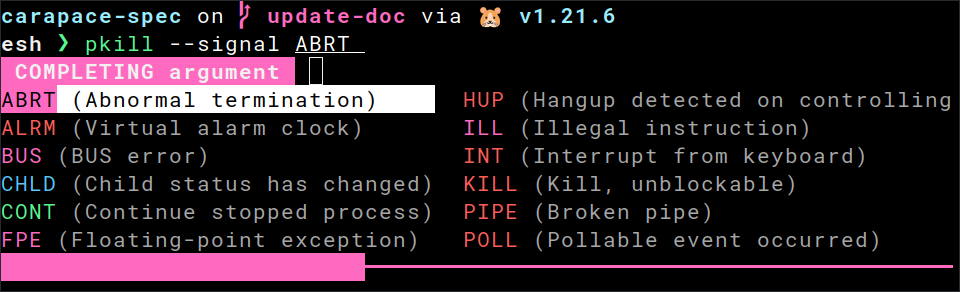
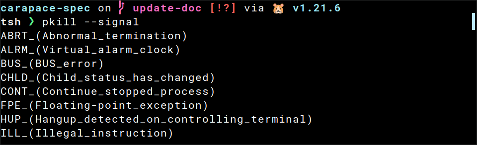

# Usage

## Bash
```sh
# ~/.bashrc
source <(carapace-spec example/pkill.yaml)
```


## Elvish
```sh
# ~/.config/elvish/rc.elv
eval (carapace-spec example/pkill.yaml|slurp)
```


## Fish
```sh
# ~/.config/fish/config.fish
carapace-spec example/pkill.yaml | source
```


## Nushell
> update config.nu according to [Multiple Completer](http://www.nushell.sh/cookbook/external_completers.html#multiple-completer))
```sh
#~/.config/nushell/config.nu
carapace-spec example/pkill.yaml
```


## Oil
```sh
# ~/.config/oil/oshrc
source <(carapace-spec example/pkill.yaml)
```


## Powershell
```sh
# ~/.config/powershell/Microsoft.PowerShell_profile.ps1
carapace-spec example/pkill.yaml | Out-String | Invoke-Expression
```


# Tcsh
```sh
## ~/.tcshrc
eval `carapace-spec example/pkill.yaml`
```


## Xonsh
```sh
# ~/.config/xonsh/rc.xsh
exec($(carapace-spec example/pkill.yaml))
```


## Zsh
```sh
# ~/.zshrc
source <(carapace-spec example/pkill.yaml)
```

